# Android Engineering Portfolio

Production Android applications, scalable mobile architecture, Firebase backend systems, dynamic content delivery, AI-powered learning experiences, and domain-specific utility software built for real-world users.

I am an **Electrical Engineer and Software Engineer** specializing in Android application development with **Kotlin, Jetpack Compose, Firebase, Room, Hilt, Coroutines, and modern Android architecture**.

My work includes educational applications used by students in Ethiopia, multi-textbook learning platforms, Firebase-backed services, AI-powered learning features, utility applications, and applications published and maintained on Google Play.

---

# 📌 Portfolio Overview

This portfolio represents three main classes of production Android engineering:

| Product | Primary Engineering Challenge |
|---|---|
| **Mathematics + Geography Grade 9** | Reusable educational architecture deployed across multiple production applications |
| **Grade 11 Textbooks** | Multi-textbook architecture, independent progress and on-demand large-content delivery |
| **Electric Bill Calculator Ethiopia** | Domain-specific software combining electrical engineering and Android development |

The projects involve the complete production chain:

> **Architecture → UI → Persistence → Backend → AI → Content Delivery → Security → Monetization → Deployment → Production Maintenance**

---

# 📚 Grade 9 Educational Platform

## 200K+ Combined Google Play Downloads

I designed, developed, published, and maintain two production educational Android applications for Ethiopian Grade 9 students:

- **Mathematics Grade 9 Textbook — 100K+ downloads**
- **Geography Grade 9 Textbook — 100K+ downloads**

Together:

> ## **200K+ combined downloads on Google Play**

Rather than being unrelated applications, Mathematics Grade 9 and Geography Grade 9 use a similar underlying Android architecture.

This allowed the engineering approach to be reused across multiple educational products while adapting textbook content and learning experiences to individual subjects.

---

## 🧮 Mathematics Grade 9 Textbook

<p align="center">
  
</p>

A production educational Android application providing Ethiopian Grade 9 students with digital access to their mathematics textbook together with mobile learning functionality.

> **100K+ downloads on Google Play**

### Major Features

- Digital textbook reading
- Chapter-based navigation
- Integrated PDF/document reader
- Reading progress tracking
- Bookmarks
- Educational summaries
- Chapter quizzes
- AI-assisted learning
- AI Tutor
- Local persistence
- Firebase-backed functionality
- Cloud-delivered educational content
- Google Mobile Ads monetization

### Screenshots

<p align="center">
  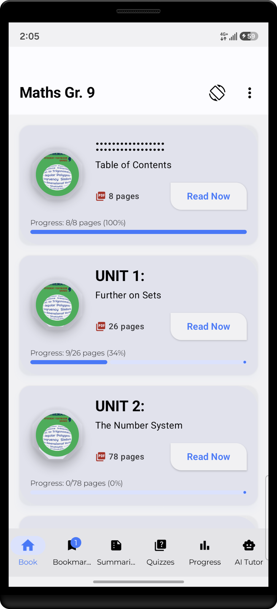
  &nbsp;
  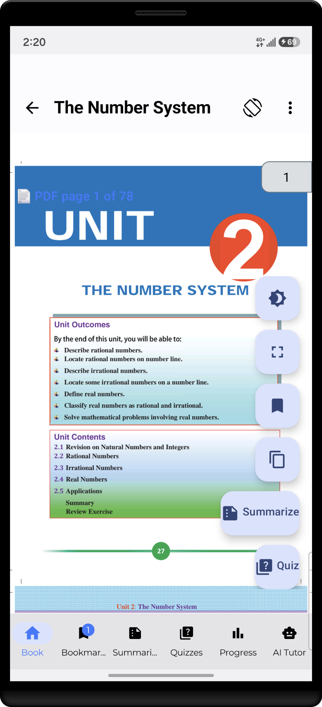
  &nbsp;
  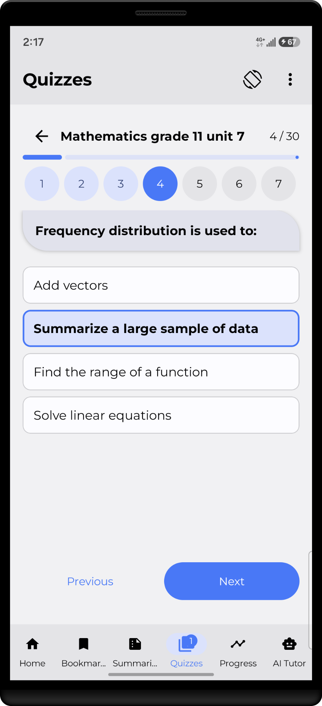
  &nbsp;
  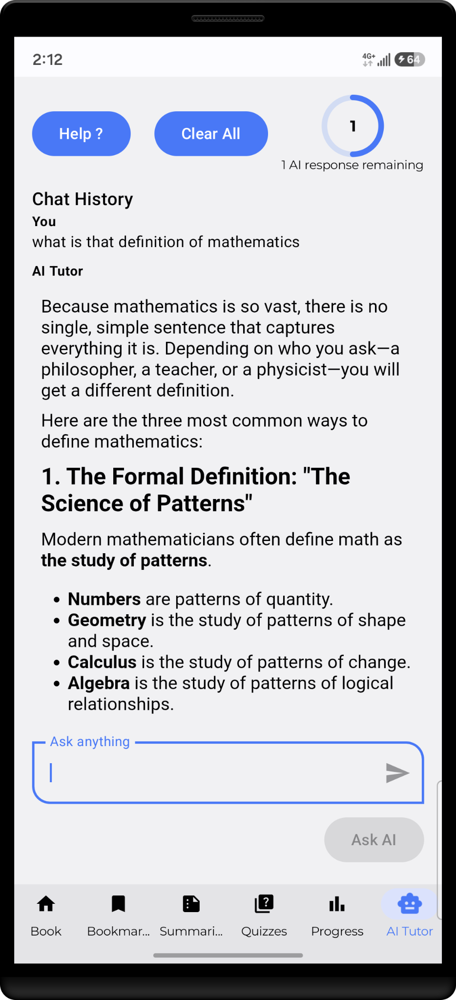
</p>

### Google Play

[View Mathematics Grade 9 Textbook on Google Play](https://play.google.com/store/apps/details?id=com.subanum63.mathematicsgr9)

---

# 🌍 Geography Grade 9 Textbook

<p align="center">
  
</p>

A production educational Android application built around Ethiopia's Grade 9 geography curriculum.

> **100K+ downloads on Google Play**

The application uses the same general educational engineering foundation as Mathematics Grade 9 while delivering geography-specific textbook and learning content.

### Major Features

- Digital textbook reading
- Chapter navigation
- Integrated PDF/document reader
- Reading progress
- Bookmarks
- Educational summaries
- Chapter quizzes
- AI-assisted learning
- AI Tutor
- Local persistence
- Firebase integration
- Cloud-backed educational content
- Google Mobile Ads monetization

### Screenshots

<p align="center">
  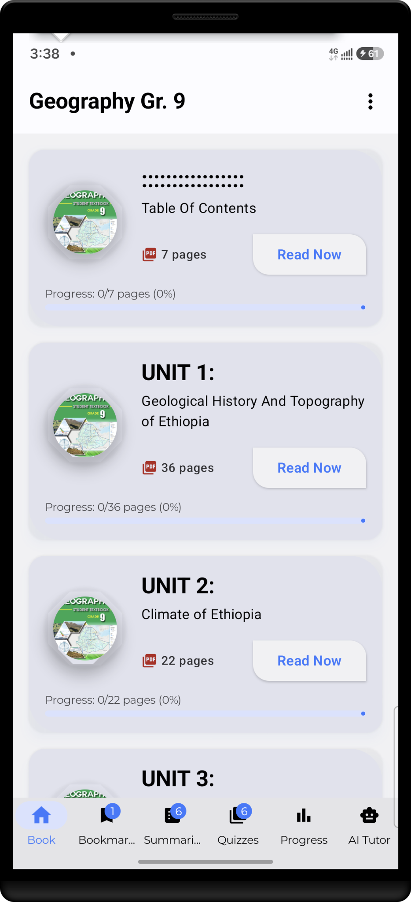
  &nbsp;
  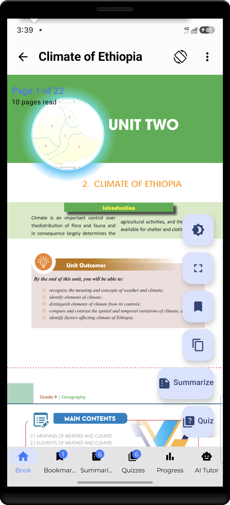
  &nbsp;
  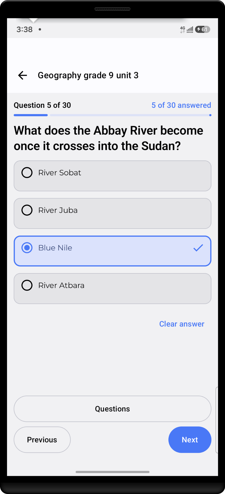
  &nbsp;
  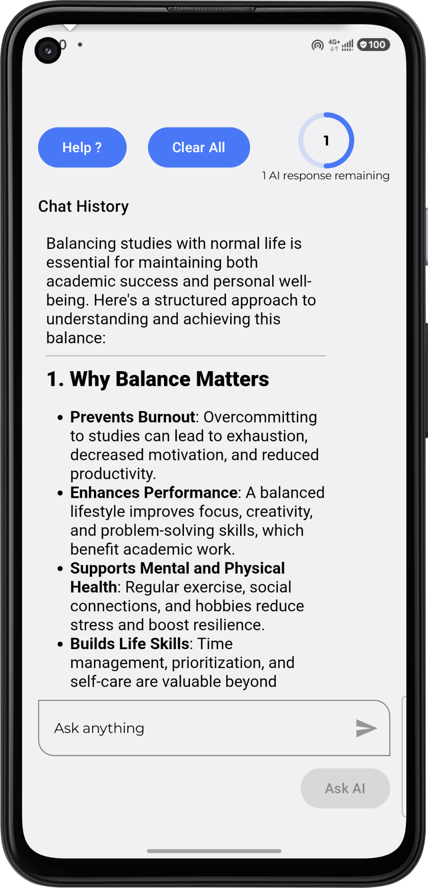
</p>

### Google Play

[View Geography Grade 9 Textbook on Google Play](https://play.google.com/store/apps/details?id=com.subanum63.geographygr9)

---

# 🏗 Shared Educational Android Architecture

The Grade 9 applications use a layered Android architecture rather than placing application and data logic directly inside Compose screens.

```text
┌─────────────────────────────────────┐
│          Jetpack Compose UI         │
│                                     │
│ Home / Chapters / Reader / Quiz     │
│ Summary / AI Tutor / Progress       │
└──────────────────┬──────────────────┘
                   │
                   ▼
┌─────────────────────────────────────┐
│              ViewModels             │
│                                     │
│ UI state / events / coordination    │
└──────────────────┬──────────────────┘
                   │
                   ▼
┌─────────────────────────────────────┐
│          Repository Layer           │
│                                     │
│ Data access / orchestration         │
└───────────┬─────────────┬───────────┘
            │             │
            ▼             ▼
┌──────────────────┐   ┌─────────────────────┐
│   Local Layer    │   │     Cloud Layer     │
│                  │   │                     │
│ • Room           │   │ • Cloud Firestore   │
│ • DataStore      │   │ • Cloud Functions   │
│ • Local assets   │   │ • Remote Config     │
└──────────────────┘   └──────────┬──────────┘
                                  │
                                  ▼
                         ┌──────────────────┐
                         │   AI Provider    │
                         │                  │
                         │  LLM inference   │
                         └──────────────────┘
```

---

# Presentation Layer

The presentation layer is built with **Jetpack Compose**.

Its responsibilities include:

- rendering application state;
- textbook and chapter navigation;
- textbook reading;
- displaying summaries;
- presenting quizzes;
- AI Tutor interaction;
- progress presentation;
- loading and error states;
- reacting to user input.

Compose screens should not directly become:

- databases;
- repositories;
- Firebase clients;
- AI API clients;
- business-rule containers.

The basic interaction pattern is:

```text
User Action
    │
    ▼
Compose UI
    │
    ▼
ViewModel
    │
    ▼
Repository / Domain Logic
    │
    ▼
Updated State
    │
    ▼
Compose UI
```

---

# ViewModel Layer

ViewModels provide the state-management boundary between Compose and the application/data layers.

Typical responsibilities include:

- loading application state;
- coordinating repository operations;
- processing user actions;
- exposing observable UI state;
- handling asynchronous results;
- mapping infrastructure results into UI-friendly state.

```text
Compose Screen
      │
      ▼
   ViewModel
      │
      ├── Load textbook state
      ├── Request summary
      ├── Load quiz
      ├── Send AI Tutor request
      └── Update progress
      │
      ▼
 Repository Layer
```

---

# Repository Layer

Repositories provide a stable interface between ViewModels and data sources.

They can coordinate:

- Room;
- Firebase;
- local assets;
- remote learning content;
- Cloud Function calls;
- progress state;
- cached educational resources.

```text
ViewModel
    │
    ▼
Repository
    │
    ├────────► Room
    │
    ├────────► Cloud Firestore
    │
    ├────────► Cloud Functions
    │
    └────────► Other data sources
```

---

# Local Persistence with Room

Room provides structured local persistence.

Depending on the feature, locally persisted information can include:

- summaries;
- quizzes;
- chapter state;
- reading progress;
- bookmarks;
- reusable educational resources;
- other structured application data.

```text
Remote / Generated Content
          │
          ▼
       Repository
          │
          ▼
         Room
          │
          ▼
Persistent Local Content
          │
          ▼
       ViewModel
          │
          ▼
      Compose UI
```

A major goal is to avoid unnecessary repeated cloud work when reusable learning content is already available locally.

---

# Chapter-Centered Learning Model

The educational architecture is organized around textbook chapters.

```text
Textbook
   │
   ▼
Chapter
   │
   ├── Reading content
   ├── Summary
   ├── Quiz
   └── AI Tutor context
```

This keeps learning functionality tied to the educational structure instead of existing as unrelated screens.

---

# Summary Workflow

```text
Student selects Summary
          │
          ▼
       ViewModel
          │
          ▼
Check Local Content
          │
     ┌────┴────┐
     │         │
 Available   Missing
     │         │
     ▼         ▼
 Display    Request backend
               │
               ▼
       Obtain content
               │
               ▼
             Room
               │
               ▼
       Persist for reuse
               │
               ▼
            Display
```

---

# Quiz Workflow

```text
Student selects Quiz
         │
         ▼
     ViewModel
         │
         ▼
Check Local Quiz
         │
    ┌────┴─────┐
    │          │
 Available   Missing
    │          │
    ▼          ▼
 Launch     Backend / Cloud
 Quiz            │
                 ▼
           Quiz Resource
                 │
                 ▼
               Room
                 │
                 ▼
          Persist Locally
                 │
                 ▼
              Launch
```

---

# 🤖 AI Tutor Backend Architecture

AI Tutor functionality uses a server-mediated architecture.

The central rule is:

> **Private AI-provider credentials and privileged backend logic do not belong inside the distributed Android client.**

The Android application handles the learning interface.

Firebase Cloud Functions provide trusted backend execution.

Cloud Firestore provides cloud-backed structured data.

The external AI provider performs model inference.

---

## High-Level AI Architecture

```text
┌──────────────────────────────────┐
│          Android Client          │
│                                  │
│      AI Tutor Compose UI         │
│      ViewModel / Repository      │
└──────────────┬───────────────────┘
               │
               │ Validated request
               ▼
┌──────────────────────────────────┐
│     Firebase Cloud Functions     │
│                                  │
│ • Request validation             │
│ • Authorization                  │
│ • Usage / access controls        │
│ • Server-side business logic     │
│ • API credential protection      │
└──────────┬───────────────┬───────┘
           │               │
           │               ▼
           │      ┌─────────────────────┐
           │      │   Cloud Firestore   │
           │      │                     │
           │      │ Learning content    │
           │      │ Application data    │
           │      │ Cloud-backed state  │
           │      └─────────────────────┘
           │
           │ Server-side API request
           ▼
┌──────────────────────────────────┐
│          AI Provider             │
│                                  │
│        LLM / AI inference        │
└──────────────┬───────────────────┘
               │
               ▼
┌──────────────────────────────────┐
│     Firebase Cloud Functions     │
│                                  │
│ • Process provider response      │
│ • Apply application rules        │
│ • Return controlled response     │
└──────────────┬───────────────────┘
               │
               ▼
┌──────────────────────────────────┐
│          Android Client          │
│                                  │
│       AI Tutor experience        │
└──────────────────────────────────┘
```

---

## Trust Boundary

The Android application is a distributed client and should not be treated as trusted secret storage.

```text
UNTRUSTED CLIENT
────────────────────────────

Android Application
        │
        ▼
Request

────────────────────────────
TRUST BOUNDARY
────────────────────────────

Firebase Cloud Functions
        │
        ├── Validate
        ├── Authorize
        ├── Apply usage controls
        ├── Access protected secrets
        └── Call external services

────────────────────────────
EXTERNAL SERVICE
────────────────────────────

AI Provider
```

---

## Why the AI Provider Is Not Called Directly

Embedding a private provider API key inside an Android APK creates unnecessary exposure.

The preferred structure is:

```text
Android APK
     │
     ▼
Cloud Function
     │
     ▼
Protected Server Configuration
     │
     ▼
AI Provider
```

This supports:

- API credential isolation;
- server-side validation;
- authorization;
- usage controls;
- centralized provider communication;
- backend business rules;
- controlled response processing.

---

## Request Lifecycle

```text
Student Question
       │
       ▼
Android UI
       │
       ▼
ViewModel
       │
       ▼
Repository
       │
       ▼
Cloud Function
       │
       ├── Validate request
       ├── Validate context
       ├── Apply access rules
       ├── Apply usage controls
       └── Build provider request
       │
       ▼
AI Provider
       │
       ▼
Generated Response
       │
       ▼
Cloud Function
       │
       ├── Validate response
       ├── Apply application rules
       └── Return controlled result
       │
       ▼
Android Client
       │
       ▼
AI Tutor UI
```

---

## Cloud Firestore vs Cloud Functions

These technologies have different responsibilities.

### Cloud Firestore

Provides:

- persistent cloud data;
- structured educational resources;
- application data;
- cloud-backed state where appropriate.

### Cloud Functions

Provides:

- trusted code execution;
- validation;
- authorization;
- protected provider communication;
- access to protected configuration;
- server-side business rules.

```text
              Firebase Backend
                     │
          ┌──────────┴──────────┐
          │                     │
          ▼                     ▼
     Firestore              Functions
          │                     │
Persistent Data       Trusted Execution
```

---

## AI Usage and Cost Control

AI-backed mobile applications introduce variable operating cost.

Important concerns include:

- request volume;
- provider pricing;
- prompt size;
- response size;
- model selection;
- usage limits;
- abuse prevention;
- optional monetization strategies.

Security- or cost-sensitive enforcement should not depend only on a client-side counter.

```text
AI Request
    │
    ▼
Server Usage Check
    │
 ┌──┴────┐
 │       │
Allowed  Limit reached
 │       │
 ▼       ▼
Call AI  Controlled rejection
```

---

# 🔥 Firebase Backend Engineering

Firebase is used as more than a simple database.

Depending on the application, the backend architecture includes:

### Cloud Firestore

Cloud-backed structured application and educational data.

### Firebase Cloud Functions

Trusted server-side operations such as:

- AI API communication;
- request validation;
- authorization;
- protected business logic;
- API credential isolation;
- controlled backend-resource access.

### Firebase Remote Config

Used where selected application behavior needs to be changed operationally without publishing a new Android release.

Remote Config can shape runtime behavior but does not replace authoritative backend authorization.

---

# 📚 Grade 11 Textbooks — Multi-Textbook Learning Platform

<p align="center">
  
</p>

Unlike the Grade 9 applications, which are centered around one primary textbook, **Grade 11 Textbooks** is designed as a multi-textbook learning platform.

The application allows multiple Grade 11 textbooks to be distributed and accessed through a single Android application.

It includes the learning capabilities of the Grade 9 architecture while adding another major engineering dimension:

> **multiple independent textbooks and on-demand large-content delivery**

---

## Multi-Textbook Architecture

```text
Grade 11 Application
        │
        ├── Subject / Textbook A
        │       ├── Chapter 1
        │       ├── Chapter 2
        │       └── ...
        │
        ├── Subject / Textbook B
        │       ├── Chapter 1
        │       ├── Chapter 2
        │       └── ...
        │
        └── Subject / Textbook N
                ├── Chapter 1
                ├── Chapter 2
                └── ...
```

This requires content and user state to be managed independently across multiple textbooks.

---

## Grade 9 vs Grade 11 State Model

### Grade 9

```text
Application
     │
     ▼
Primary Textbook
     │
     ├── Chapters
     ├── Progress
     └── Learning Features
```

### Grade 11

```text
Application
     │
     ▼
Textbook Catalog
     │
     ├── Textbook A
     │      ├── Chapters
     │      ├── Progress
     │      └── Learning Features
     │
     ├── Textbook B
     │      ├── Chapters
     │      ├── Progress
     │      └── Learning Features
     │
     └── Textbook N
```

The important architectural principle is:

> **State needs ownership.**

Progress, bookmarks, summaries, quizzes, and reading position need enough identity to belong to the correct textbook.

---

## Grade 11 Major Features

- Multiple textbooks in one application
- Subject/textbook catalog
- Chapter navigation
- PDF/document reading
- Per-textbook reading progress
- Persistent progress tracking
- Bookmarks
- Educational summaries
- Quizzes
- Quiz progress
- AI Tutor
- Firebase integration
- Cloud Firestore
- Firebase Cloud Functions
- Firebase Remote Config
- Google Play Asset Delivery
- On-demand textbook assets
- Dynamic asset-state handling
- Production monetization

---

## Screenshots

<p align="center">
  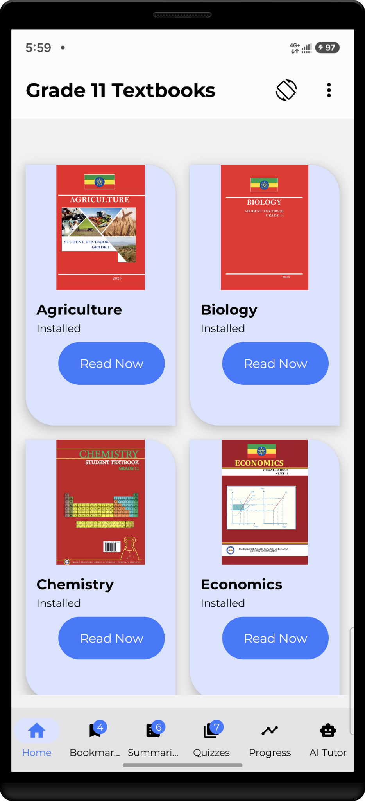
  &nbsp;
  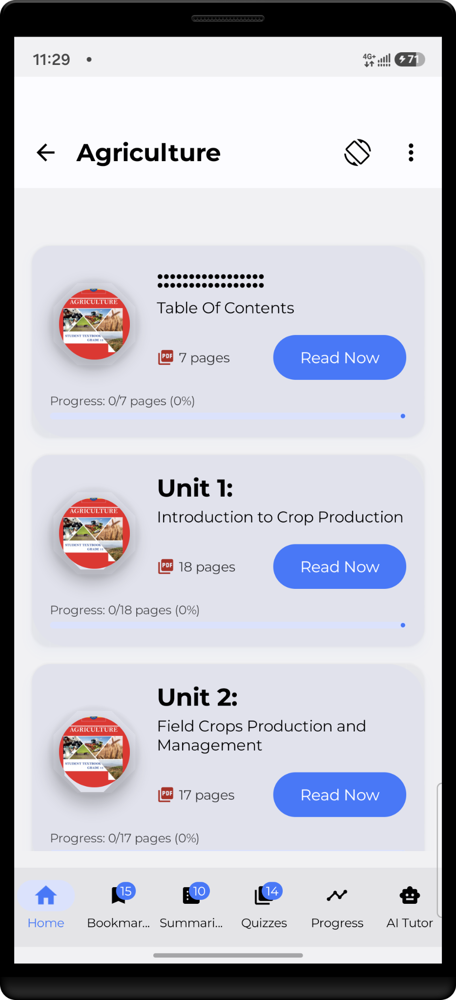
  &nbsp;
  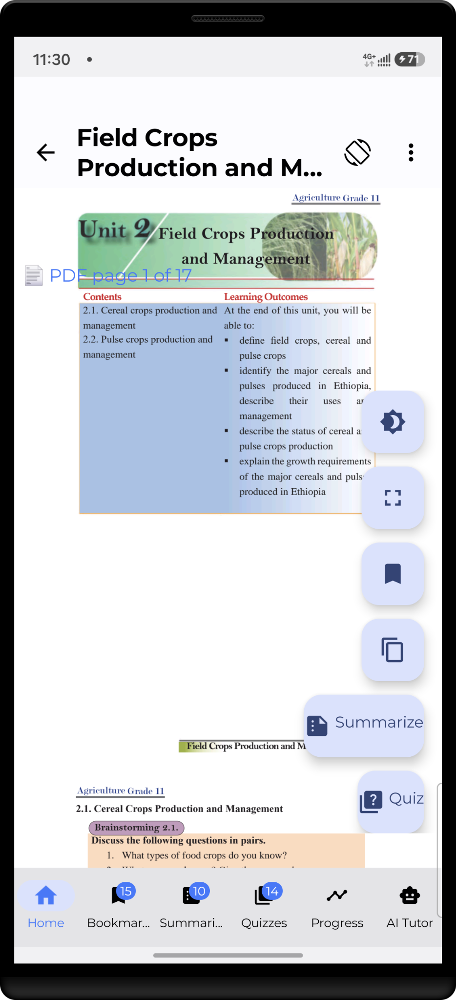
  &nbsp;
  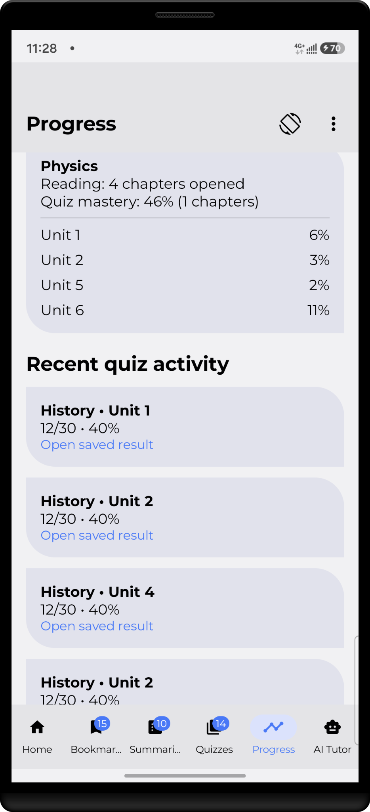
</p>

---

# 📦 Google Play Asset Delivery Architecture

A multi-textbook application creates a distribution problem.

If every textbook is packaged into the base application:

```text
Base Application
    │
    ├── Application code
    ├── UI resources
    ├── Mathematics textbook
    ├── Physics textbook
    ├── Chemistry textbook
    ├── Biology textbook
    └── Additional textbooks
```

the initial application download can grow substantially.

The Grade 11 application addresses this using **Google Play Asset Delivery**.

---

## Architectural Principle

The platform separates application functionality from large textbook content.

```text
Application Functionality
          │
          ├── Kotlin code
          ├── Jetpack Compose UI
          ├── Navigation
          ├── Textbook catalog
          ├── Progress tracking
          ├── Summaries
          ├── Quizzes
          ├── AI Tutor
          └── Asset-delivery coordination

Large Textbook Content
          │
          ├── Asset Pack A
          ├── Asset Pack B
          ├── Asset Pack C
          └── Asset Pack N
```

The application controls the learning experience.

Google Play handles delivery of the large textbook resources.

---

## On-Demand Delivery

Not every student needs every textbook immediately.

```text
Install Grade 11 App
        │
        ▼
Base application available
        │
        ▼
Student chooses textbook
        │
        ▼
Required asset available?
        │
   ┌────┴────┐
   │         │
  Yes        No
   │         │
   ▼         ▼
Open       Request asset
book         │
             ▼
      Google Play Delivery
             │
             ▼
       Download textbook
             │
             ▼
          Open book
```

---

## Textbook Identity

Dynamic content delivery depends on stable textbook identity.

Conceptually:

```text
Textbook
├── Textbook ID
├── Subject
├── Display metadata
├── Asset-pack identity
└── Progress identity
```

Textbook identity links:

- catalog navigation;
- asset delivery;
- progress;
- chapter context;
- bookmarks;
- learning features.

---

## Textbook-to-Asset Mapping

```text
Textbook Catalog
      │
      ├── Mathematics ─────► mathematics_asset_pack
      ├── Physics ─────────► physics_asset_pack
      ├── Chemistry ───────► chemistry_asset_pack
      ├── Biology ─────────► biology_asset_pack
      └── Other subject ───► corresponding_asset_pack
```

This connects the application's logical textbook model to physical content delivered through Google Play.

---

## Complete Delivery Flow

```text
Student selects textbook
          │
          ▼
Resolve textbook identity
          │
          ▼
Resolve required asset pack
          │
          ▼
Check asset availability
          │
     ┌────┴─────┐
     │          │
     ▼          ▼
 Available    Missing
     │          │
     │          ▼
     │     Request asset
     │          │
     │          ▼
     │    Track delivery
     │          │
     │     ┌────┴─────┐
     │     │          │
     │     ▼          ▼
     │   Ready      Failed
     │     │          │
     │     │          └──► Retry / error
     │     │
     └─────┴───────────────┐
                           ▼
                 Resolve textbook files
                           │
                           ▼
                    Open textbook
```

---

## Asset State

On-demand delivery is asynchronous.

```text
NOT_AVAILABLE
      │
      ▼
REQUESTED
      │
      ▼
DOWNLOADING
      │
      ├──────────────► FAILED
      │                   │
      │                   ▼
      │                 RETRY
      │
      ▼
AVAILABLE
      │
      ▼
READY
```

The UI needs to distinguish between:

> **content is missing**

and:

> **content has not been delivered yet**

Those are different application states.

---

## Independent Asset State

A multi-textbook system cannot use one global boolean such as:

```text
textbooksDownloaded = true
```

Different textbooks may have different states:

```text
Mathematics    AVAILABLE
Physics        DOWNLOADING
Chemistry      NOT_AVAILABLE
Biology        AVAILABLE
```

Asset state therefore belongs to the corresponding textbook/asset identity.

---

## Compose and ViewModel Responsibilities

```text
Compose Screen
      │
      ▼
ViewModel
      │
      ▼
Asset Delivery Coordinator
      │
      ▼
Google Play Asset Delivery
```

Compose renders:

- preparing;
- download progress;
- ready state;
- failure;
- retry.

The lower delivery layer handles Google Play integration.

---

## Progress Is Separate from Delivery

Play Asset Delivery solves content distribution.

It does not own reading progress.

```text
Asset Delivery
      │
      ▼
Textbook Available
      │
      ▼
Reader
      │
      ▼
Reading Progress
      │
      ▼
Room
```

Reading progress belongs to stable textbook identity rather than a temporary physical file path.

---

## PAD Production Testing

Important scenarios include:

| Scenario | Expected Behavior |
|---|---|
| Textbook already available | Open without unnecessary re-download |
| Textbook missing | Begin on-demand request |
| Download active | Show progress |
| Download succeeds | Resolve content and open |
| Download fails | Show controlled retry/error |
| Network unavailable | Explain unavailable delivery |
| Activity recreated | Restore current delivery state |
| Another textbook selected | Track the correct pack independently |
| Application updated | Correctly resolve current assets |
| New textbook added | New catalog/asset mapping works |

Play Asset Delivery should be tested as a state machine rather than only through one successful download.

---

# ⚡ Electric Bill Calculator Ethiopia

<p align="center">
  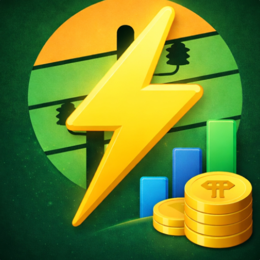
</p>

Electric Bill Calculator Ethiopia is a production Android utility application designed to help Ethiopian electricity customers calculate, understand, and manage electricity-related billing information.

Unlike the educational applications, this project addresses a different domain and connects my two engineering backgrounds:

> **Electrical Engineering + Software Engineering**

The engineering challenge is not merely displaying tariff information.

The application translates electricity-domain rules into structured calculations, manages meter-related state, stores historical information, and supports reporting/export.

---

## Engineering Objective

```text
Electricity Domain Rules
          │
          ▼
     Domain Model
          │
          ▼
 Calculation Engine
          │
          ▼
 Application Logic
          │
          ▼
   Android UI / UX
          │
          ▼
Persistent User Data
          │
          ▼
 Reporting / Export
          │
      ┌───┴───┐
      ▼       ▼
     CSV     PDF
```

---

## High-Level Architecture

```text
┌───────────────────────────────────────┐
│            Android Client             │
│                                       │
│       Kotlin / Jetpack Compose        │
└──────────────────┬────────────────────┘
                   │
                   ▼
┌───────────────────────────────────────┐
│              ViewModel                │
│                                       │
│   UI state / events / coordination    │
└──────────────────┬────────────────────┘
                   │
                   ▼
┌───────────────────────────────────────┐
│         Application / Domain          │
│                                       │
│ • Electricity calculations            │
│ • Tariff rules                        │
│ • Meter logic                         │
│ • Billing logic                       │
└──────────────────┬────────────────────┘
                   │
                   ▼
┌───────────────────────────────────────┐
│           Repository Layer            │
└───────────┬───────────────┬───────────┘
            │               │
            ▼               ▼
      Room / Local       Firebase
       Persistence        Services
            │
            ▼
      Historical Data
            │
            ▼
       Reporting Layer
        ┌──────┴──────┐
        ▼             ▼
       CSV           PDF
```

---

## Electricity Domain Model

A production electricity calculator is not necessarily equivalent to:

```text
Bill = Consumption × One Fixed Rate
```

The software separates:

- meter readings;
- consumption;
- tariff logic;
- tariff blocks;
- applicable charges;
- calculation results;
- meter profiles;
- historical records;
- presentation;
- reporting.

The objective is to prevent complex domain logic from becoming tightly coupled to the Android UI.

---

## Meter Reading to Consumption

```text
Previous Meter Reading
          +
Current Meter Reading
          │
          ▼
Determine Consumption
          │
          ▼
Apply Billing Rules
```

At the simplest conceptual level:

```text
Consumption = Current Reading - Previous Reading
```

Input validation is important because invalid readings should not silently generate misleading billing results.

---

## Tariff Calculation Engine

```text
Consumption
     │
     ▼
Tariff Engine
     │
     ├── Determine applicable tariff structure
     ├── Evaluate consumption blocks
     ├── Apply applicable rates
     ├── Apply applicable charges
     └── Produce structured result
     │
     ▼
Billing Result
```

Tariff calculations belong to domain/application logic rather than directly inside Compose screens.

---

## Block-Based Tariff Calculation

Where pricing uses consumption blocks:

```text
Total Consumption
       │
       ▼
┌─────────────────┐
│ Consumption     │
│ Block 1         │
└────────┬────────┘
         │
         ▼
┌─────────────────┐
│ Consumption     │
│ Block 2         │
└────────┬────────┘
         │
         ▼
┌─────────────────┐
│ Consumption     │
│ Block 3         │
└────────┬────────┘
         │
         ▼
       ...
         │
         ▼
Combine applicable
block charges
         │
         ▼
Energy Charge
```

---

## Structured Billing Result

The calculator produces structured information rather than only one unexplained total.

```text
Billing Result
│
├── Consumption
├── Energy charge
├── Applicable service charges
├── Other applicable components
└── Total
```

The same result can feed several application features:

```text
Calculation Engine
       │
       ▼
Structured Result
       │
       ├──► Compose UI
       ├──► History
       ├──► CSV Export
       └──► PDF Report
```

---

## Multiple Meter Profiles

The application supports multiple meter-related profiles.

```text
User
 │
 ├── Meter Profile A
 │      ├── Meter information
 │      ├── Billing history
 │      └── Reading state
 │
 ├── Meter Profile B
 │      ├── Meter information
 │      ├── Billing history
 │      └── Reading state
 │
 └── Meter Profile N
        ├── Meter information
        ├── Billing history
        └── Reading state
```

Again, the architectural principle is:

> **State needs ownership.**

Billing and reading information must remain associated with the correct meter.

---

## Camera-Assisted Meter Workflow

The application includes camera-assisted functionality for meter-related workflows.

```text
Electricity Meter
       │
       ▼
Device Camera
       │
       ▼
Meter Reading Capture
       │
       ▼
Reading Processing
       │
       ▼
User Verification
       │
       ▼
Validated Meter Value
       │
       ▼
Calculation Workflow
```

Automated recognition should not silently become trusted billing input without an opportunity for validation.

---

## Historical Billing Data

Persisting calculations turns the application from a one-time calculator into a continuing utility.

```text
Enter values
     │
     ▼
Calculate
     │
     ▼
Structured result
     │
     ├──► Display
     │
     └──► Persist
              │
              ▼
          History
              │
              ├──► Review
              ├──► Compare
              └──► Export
```

---

# 📄 CSV & PDF Reporting

The application includes data-export functionality for generating **CSV and PDF files**.

```text
Stored Calculation /
Billing History
        │
        ▼
    Repository
        │
        ▼
  Reporting Layer
        │
   ┌────┴────┐
   │         │
   ▼         ▼
CSV Export  PDF Export
   │         │
   └────┬────┘
        │
        ▼
Generated File
        │
        ▼
Android Share /
File Workflow
```

---

## CSV Export

CSV provides structured historical calculation data.

```text
Room / Historical Data
          │
          ▼
Select Export Records
          │
          ▼
Normalize Data
          │
          ▼
Generate CSV Rows
          │
          ▼
Create CSV File
          │
          ▼
Share / Save
```

Potential fields include:

```text
Date
Meter
Previous Reading
Current Reading
Consumption
Energy Charge
Additional Charges
Total
```

CSV is suitable for spreadsheet use and further data analysis.

---

## PDF Export

PDF provides a human-readable report.

```text
Calculation / History Data
          │
          ▼
     Report Model
          │
          ▼
     PDF Generator
          │
          ▼
Formatted PDF Report
          │
          ▼
     Share / Save
```

PDF reports are useful for:

- reading;
- archiving;
- sharing;
- printing.

---

## Why Support Both?

| Format | Primary Purpose |
|---|---|
| **CSV** | Structured data, spreadsheet use and analysis |
| **PDF** | Human-readable reporting, sharing and archiving |

The reporting layer consumes structured application data rather than independently recalculating the bill.

```text
                  Calculation Engine
                         │
                         ▼
                 Structured Result
                         │
            ┌────────────┼────────────┐
            │            │            │
            ▼            ▼            ▼
        Compose UI      CSV          PDF
                       Export       Export
```

---

## Multilingual User Experience

The application supports an Ethiopian user base through localized presentation.

The architecture keeps localization separate from the calculation engine.

```text
Domain Logic
     │
     ▼
Structured Result
     │
     ▼
Presentation Layer
     │
     ▼
Localized Resources
     │
     ├── English
     ├── Amharic
     ├── Afaan Oromo
     └── Tigrinya
```

The underlying calculation should not change because the presentation language changes.

---

## Offline-Oriented Calculation

Core electricity calculations should not unnecessarily depend on network availability.

```text
User Input
    │
    ▼
Local Validation
    │
    ▼
Local Tariff Logic
    │
    ▼
Calculation
    │
    ▼
Room Persistence
    │
    ▼
Result
```

Firebase can enhance the application without becoming an unnecessary dependency for basic calculations.

---

## Electric Bill Calculator Screenshots

<p align="center">
  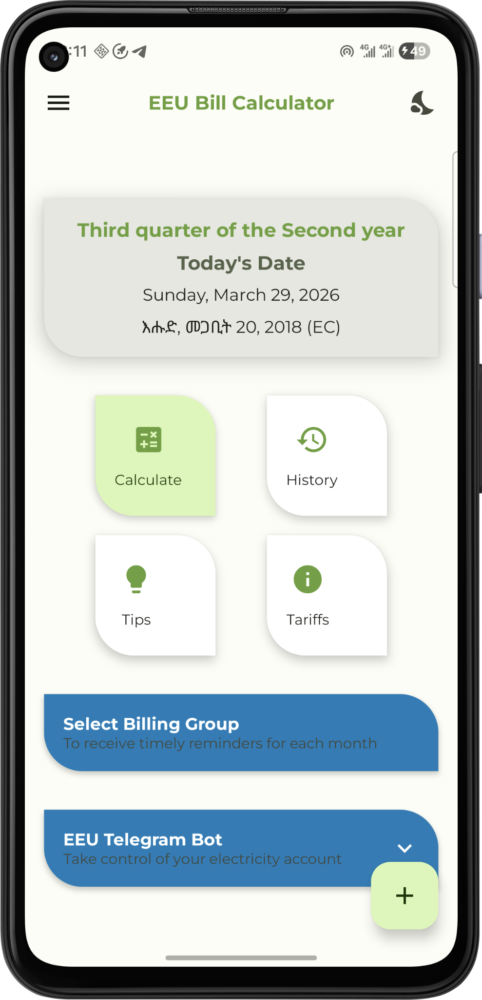
  &nbsp;
  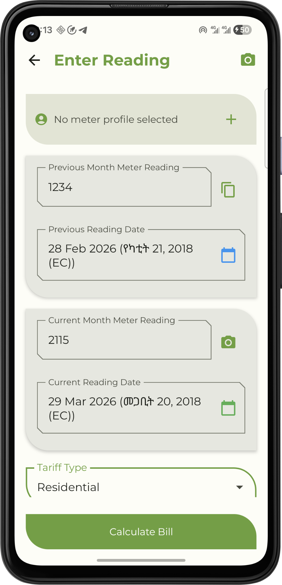
  &nbsp;
  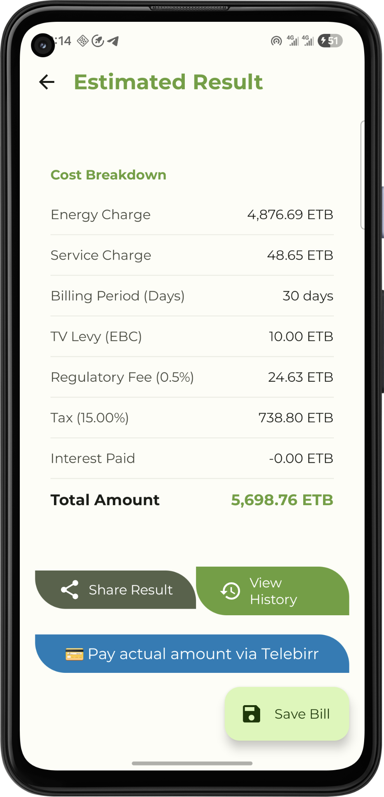
  &nbsp;
  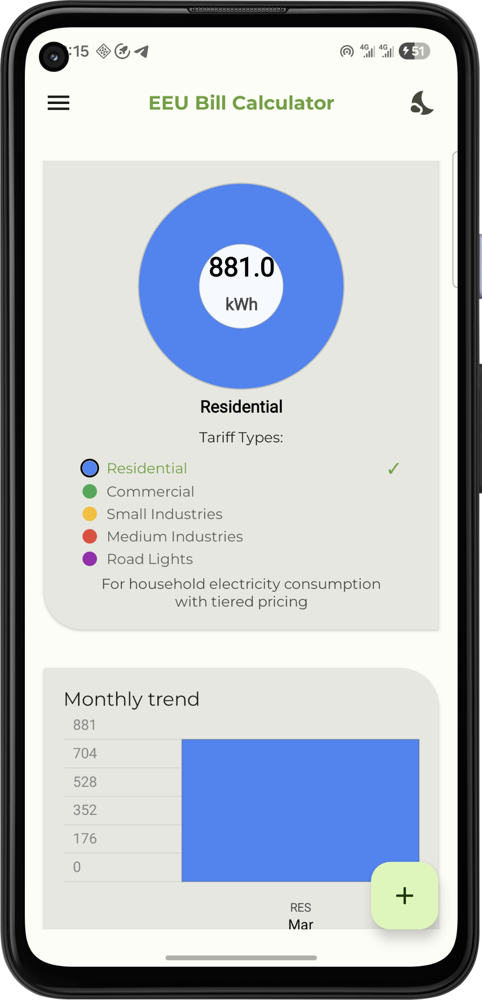
</p>

### Google Play

[View Electric Bill Calculator Ethiopia on Google Play](https://play.google.com/store/apps/details?id=com.et.subanum63.electricbillcalculator)

---

# 🔄 Comparison of the Three Engineering Systems

| Engineering Area | Grade 9 Apps | Grade 11 Platform | Electric Bill Calculator |
|---|---:|---:|---:|
| Kotlin | ✅ | ✅ | ✅ |
| Jetpack Compose | ✅ | ✅ | ✅ |
| ViewModel | ✅ | ✅ | ✅ |
| Repository Pattern | ✅ | ✅ | ✅ |
| Room | ✅ | ✅ | ✅ |
| Hilt | ✅ | ✅ | ✅ |
| Coroutines / Flow | ✅ | ✅ | ✅ |
| Firebase | ✅ | ✅ | ✅ |
| Cloud Firestore | ✅ | ✅ | Application dependent |
| Cloud Functions | ✅ | ✅ | Application dependent |
| AI Tutor | ✅ | ✅ | — |
| Textbook Reading | ✅ | ✅ | — |
| Summaries | ✅ | ✅ | — |
| Quizzes | ✅ | ✅ | — |
| Multiple Textbooks | — | ✅ | — |
| Play Asset Delivery | — | ✅ | — |
| Multiple Meter Profiles | — | — | ✅ |
| Electrical Tariff Engine | — | — | ✅ |
| Camera-Assisted Meter Workflow | — | — | ✅ |
| CSV Export | — | — | ✅ |
| PDF Export | — | — | ✅ |
| Google Mobile Ads | ✅ | ✅ | ✅ |
| Google Play Production | ✅ | ✅ | ✅ |

---

# 🧰 Core Technology Stack

| Area | Technologies |
|---|---|
| **Language** | Kotlin |
| **UI** | Jetpack Compose, Material Design |
| **Architecture** | ViewModel, Repository Pattern |
| **Dependency Injection** | Hilt |
| **Persistence** | Room |
| **Preferences / Local State** | DataStore where appropriate |
| **Asynchronous Programming** | Kotlin Coroutines / Flow |
| **Backend** | Firebase |
| **Cloud Database** | Cloud Firestore |
| **Server-side Logic** | Firebase Cloud Functions |
| **Configuration** | Firebase Remote Config |
| **AI Integration** | Server-mediated LLM integration |
| **Large Content Delivery** | Google Play Asset Delivery |
| **Reporting** | CSV / PDF |
| **Distribution** | Google Play |
| **Monetization** | Google Mobile Ads |
| **Version Control** | Git / GitHub |

---

# 🔐 Security Architecture

Production mobile applications should treat the Android client as a distributed, inspectable environment.

Important engineering practices include:

- keeping sensitive API credentials outside Android clients;
- server-side validation;
- authorization for privileged operations;
- separating client and backend responsibilities;
- protecting external AI-provider credentials;
- controlled backend resource access;
- Firebase authorization and access controls;
- secure release configuration;
- application signing;
- privacy and consent handling.

The central trust model is:

```text
UNTRUSTED CLIENT
─────────────────────────
Android Application
        │
        ▼
Validated Request

TRUSTED BACKEND
─────────────────────────
Cloud Functions
        │
        ├── Validation
        ├── Authorization
        ├── Protected credentials
        ├── Business rules
        └── External service access
```

---

# 💰 Production Monetization

The applications use **Google Mobile Ads**.

Advertising is treated as a production subsystem rather than simply an SDK call.

Relevant concerns include:

- consent;
- placement;
- user intent;
- accidental-click risk;
- frequency;
- lifecycle state;
- policy compliance;
- fullscreen coordination;
- testing.

Conceptually:

```text
Application Experience
        │
        ▼
Ad Placement Policy
        │
        ├── Placement allowed?
        ├── Consent satisfied?
        ├── Frequency acceptable?
        ├── Lifecycle state safe?
        └── User intent respected?
        │
        ▼
Google Mobile Ads
```

---

# 🎁 Rewarded Learning Flows

Rewarded advertising can be used where a student explicitly chooses an optional unlock path.

```text
Student chooses optional feature
            │
            ▼
Explain unlock option
            │
            ▼
Student explicitly accepts
            │
            ▼
Rewarded Ad
            │
        ┌───┴────┐
        │        │
    Rewarded   Not rewarded
        │        │
        ▼        ▼
Continue      No unlock
feature
```

Explicit choice separates a rewarded flow from an unexpected fullscreen advertisement.

---

# 🔄 Lifecycle-Aware Engineering

Android applications must handle:

- activity recreation;
- configuration changes;
- process interruption;
- navigation changes;
- foreground/background transitions;
- long-running downloads;
- network requests;
- AI requests.

Important state should therefore not exist only inside temporary composables.

```text
Compose Screen
      │
      ▼
Observe State
      │
      ▼
ViewModel / Persistent Layer
      │
      ▼
Current Application State
```

This applies especially to:

- learning progress;
- active requests;
- downloaded resources;
- asset delivery;
- ad state;
- AI operations.

---

# 🧪 Testing Strategy

The architecture makes important logic testable independently from Compose UI.

Examples include:

### Educational Applications

- progress state;
- content identity;
- quiz mapping;
- summary persistence;
- repository behavior;
- asset-delivery state;
- backend request handling.

### Electric Bill Calculator

- consumption boundaries;
- tariff-block boundaries;
- zero consumption;
- high consumption;
- invalid readings;
- charge calculations;
- rounding;
- meter ownership;
- report-data generation.

### Reporting

CSV tests can verify:

- column order;
- record mapping;
- escaping;
- formatting;
- empty datasets;
- multiple meter profiles.

PDF-related tests can verify:

- report data;
- expected sections;
- valid generation;
- missing-data handling;
- file-generation failures.

---

# 📱 Production Android Engineering

Building a production application involves considerably more than implementing screens.

My Android work includes:

- application architecture;
- application signing;
- release configuration;
- dependency management;
- Google Play deployment;
- Firebase production configuration;
- advertising compliance;
- consent handling;
- device compatibility;
- lifecycle handling;
- backend maintenance;
- Remote Config safeguards;
- Play Asset Delivery;
- release testing;
- production maintenance.

---

# 🧠 Engineering Principles

## UI should render state

Compose screens should not become repositories, databases, calculation engines, or backend clients.

## State needs ownership

Reading progress belongs to a textbook.

Billing history belongs to a meter.

Asset state belongs to an asset/textbook identity.

## Local and cloud data solve different problems

Room and Firestore are complementary rather than interchangeable.

## Protected operations belong on the backend

Privileged AI communication and secrets should remain outside the Android APK.

## Reusable content should be persisted

Repeated network/backend work should be avoided when reusable content is already available locally.

## Large content is an architecture problem

Adding several textbooks changes distribution, state management, progress identity, and application lifecycle behavior.

## Domain logic should remain independent of UI

Electricity tariff calculations should not live inside Compose screens.

## Production monetization needs policy

An ad being technically available does not mean it should appear at every possible transition.

## Architecture should evolve with product complexity

The Grade 11 system extends the Grade 9 architecture rather than forcing a single-textbook model onto a multi-textbook platform.

---

# ⚡ Electrical Engineering + Software Engineering

Electric Bill Calculator Ethiopia demonstrates the connection between my electrical-engineering background and software engineering.

```text
Electrical Engineering
        │
        ├── Electricity consumption
        ├── Meter readings
        ├── Tariff understanding
        └── Billing-domain knowledge
        │
        ▼
     Domain Model
        │
        ▼
Software Engineering
        │
        ├── Kotlin
        ├── Android architecture
        ├── Room
        ├── Compose
        ├── Firebase
        ├── CSV/PDF reporting
        └── Production deployment
        │
        ▼
Electric Bill Calculator Ethiopia
```

The engineering value comes from translating domain knowledge into maintainable production software.

---

# 📊 Engineering Experience Demonstrated

Across these systems, the portfolio demonstrates practical experience with:

- Kotlin
- Jetpack Compose
- Material Design
- ViewModel
- Repository architecture
- Room
- Hilt
- Kotlin Coroutines / Flow
- DataStore
- PDF/document reading
- Local persistence
- Firebase
- Cloud Firestore
- Firebase Cloud Functions
- Firebase Remote Config
- Server-mediated AI integration
- AI Tutor architecture
- API credential isolation
- Multi-textbook architecture
- Content identity
- Progress tracking
- Google Play Asset Delivery
- On-demand asset delivery
- Download-state handling
- Electricity-domain modeling
- Tariff calculation
- Multiple meter profiles
- Camera-assisted meter workflows
- CSV generation
- PDF reporting
- Android file sharing
- Localization
- Google Mobile Ads
- Production release management
- Google Play deployment
- Production maintenance

---

# 📁 Repository Structure

After consolidating the documentation into this README, the repository can be simplified to:

```text
android-engineering-portfolio/
│
├── README.md
│
└── assets/
    │
    ├── app-icons/
    │   ├── maths_grade_9_play_icon.png
    │   ├── grade_9_geography_app_icon.png
    │   ├── grade_11_play_app_icon.png
    │   └── ebc_app_icon.png
    │
    └── screenshots/
        │
        ├── mathematics-grade-9/
        │   ├── mathematics-grade9-home.png
        │   ├── mathematics-grade9-pdf-reader.png
        │   ├── mathematics-grade9-pdf-page.png
        │   ├── mathematics-grade9-summary.png
        │   ├── mathematics-grade9-quiz.png
        │   └── mathematics-grade9-ai-tutor.png
        │
        ├── geography-grade-9/
        │   ├── geography-grade9-home.png
        │   ├── geography-grade9-pdf-reader.png
        │   ├── geography-grade9-summary.png
        │   ├── geography-grade9-quiz.png
        │   ├── geography-grade9-quiz-result.png
        │   ├── geography-grade9-progress.png
        │   └── geography-grade9-ai-tutor.png
        │
        ├── grade-11-textbooks/
        │   ├── grade11-multi-subject-library.png
        │   ├── grade11-asset-download.png
        │   ├── grade11-subject-units.png
        │   ├── grade11-pdf-reader.png
        │   ├── grade11-cross-subject-bookmarks.png
        │   ├── grade11-cross-subject-summaries.png
        │   ├── grade11-quiz.png
        │   └── grade11-progress-tracking.png
        │
        └── electric-bill-calculator/
            ├── electric-bill-calculator-home.png
            ├── electric-bill-calculator-enter-reading.png
            ├── electric-bill-calculator-estimated-result.png
            ├── electric-bill-calculator-consumption-dashboard.png
            ├── electric-bill-calculator-tariffs-overview.png
            ├── electric-bill-calculator-tariff-plans.png
            ├── electric-bill-calculator-bill-history.png
            ├── electric-bill-calculator-bill-details.png
            └── electric-bill-calculator-energy-saving-tips.png
```

The repository intentionally focuses on **engineering documentation, architecture, production experience, and real application evidence** rather than publishing proprietary production source code.

---

# 🔒 Repository Scope

The production application and backend repositories remain private.

This portfolio intentionally describes:

- architecture;
- engineering decisions;
- data flow;
- domain modeling;
- system boundaries;
- production workflows;
- technology choices;
- high-level security decisions;
- publicly visible applications.

It intentionally does **not** expose:

- proprietary production source code;
- signing credentials;
- API keys;
- private Firebase configuration;
- protected backend configuration;
- private textbook assets;
- production secrets.

---

# 🎯 Current Engineering Focus

My current engineering work focuses on:

- Production Android development
- Kotlin
- Jetpack Compose
- Scalable Android architecture
- Firebase backend engineering
- Cloud Functions
- Cloud Firestore
- AI-assisted mobile applications
- Secure AI API integration
- Large educational content delivery
- Google Play production engineering

---

# 👨‍💻 About Me

I am an **Electrical Engineer and Software Engineer** with experience developing and maintaining production Android applications.

My work sits at the intersection of:

> **Electrical Engineering + Android Development + Backend Engineering + AI-assisted Applications**

I am particularly interested in building practical mobile software that solves real-world problems and can be deployed, scaled, and maintained for real users.

---

# 🔗 Profiles

- **GitHub:** [SUBANUM63](https://github.com/SUBANUM63)
- **LinkedIn:** [Zeinu Kedir](https://www.linkedin.com/in/zeinu-kedir-426025222/)
- **Portfolio:** [jumanapps.com](https://jumanapps.com)

---

# Final Engineering Perspective

These applications represent three stages of engineering complexity:

```text
Reusable Single-Textbook Architecture
                │
                ▼
Multi-Textbook Learning Platform
                │
                ▼
Domain-Specific Utility Engineering
```

The Grade 9 applications demonstrate a reusable educational architecture operating at meaningful production scale.

The Grade 11 platform extends that architecture with multiple textbook identities, independent state management, progress tracking, and Google Play Asset Delivery.

Electric Bill Calculator Ethiopia demonstrates that the same Android engineering capabilities can be applied outside educational software to an electrical-engineering domain involving calculations, meter management, persistence, and CSV/PDF reporting.

Together, the portfolio demonstrates more than Android UI development:

> **real-world product engineering across mobile architecture, persistence, Firebase backend systems, AI integration, dynamic content delivery, domain modeling, monetization, security, and Google Play production deployment.**

---

> This portfolio is continuously updated as production applications and engineering systems evolve.
